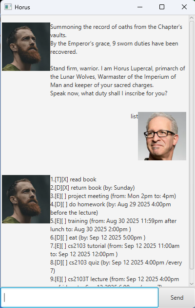

# Horus User Guide

 

This is Horus, your personal assistant to help track tasks, deadlines and events!

## Adding deadlines

Use the commands `todo`, `deadline` and `event` to add tasks:
- `todo buy groceries`
- `deadline homework /by 1700 1/1/2025`
- `event class /from 1200 1/1/2025 /to 1500 1/1/2025`

Use `list` to view your added tasks:

> 1.[T][ ] buy groceries \
> 2.[D][ ] homework (by: Jan 1 2025 5:00pm ) \
> 3.[E][ ] class (from: Jan 1 2025 12:00pm  to: Jan 1 2025 3:00pm )

## Marking and unmarking tasks

Use the commands `mark` to mark tasks as done:
- `mark 1`

The task will be marked as done as shown when calling `list`:
> 1.[T][X] buy groceries \
> 2.[D][ ] homework (by: Jan 1 2025 5:00pm ) \
> 3.[E][ ] class (from: Jan 1 2025 12:00pm  to: Jan 1 2025 3:00pm )

Use the commands `unmark` to unmark a task:
- `unmark 1`

Now when calling `list`:
> 1.[T][ ] buy groceries \
> 2.[D][ ] homework (by: Jan 1 2025 5:00pm ) \
> 3.[E][ ] class (from: Jan 1 2025 12:00pm  to: Jan 1 2025 3:00pm )

## Finding tasks

Use the `find` command to search for tasks using keywords:

`find homework` :
> 1.[D][ ] cs1101 homework \
> 2.[D][ ] cs2030 homework (by: Jan 1 2025 5:00pm )
